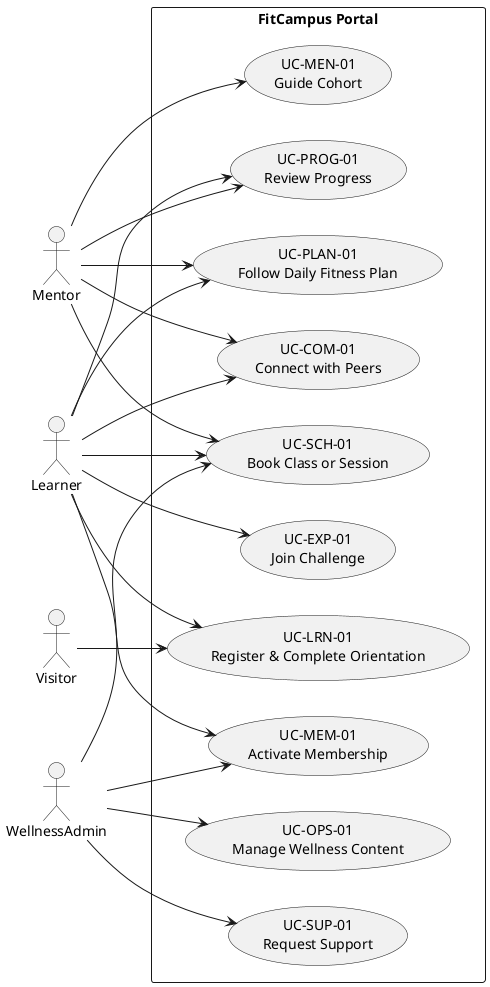

# Use Case Specification – FitCampus Student Portal

## UC-LRN-01 – Register & Complete Orientation
- **Primary Actor:** Visitor/Learner
- **Level:** User goal
- **Stakeholders & Interests:**
  - Learner: Fast onboarding, clarity on expectations, personalized start.
  - Student Affairs: Accurate data capture, consent compliance, conversion metrics.
- **Preconditions:** Orientation microsite published; consent templates configured.
- **Postconditions:** Learner account created, readiness quiz stored, orientation checklist unlocked.
- **Main Flow:**
  1. Visitor selects "Bắt đầu" CTA.
  2. System displays sign-in options (campus SSO, email, social).
  3. Learner completes registration; system verifies identity/OTP.
  4. System launches readiness quiz with dynamic questions.
  5. Learner submits responses; system highlights safety guidance if needed.
  6. System enrolls learner into orientation plan and sends welcome notification.
- **Alternative Flows:**
  - A1: SSO unavailable → System offers email registration fallback.
  - A2: High-risk answer → System requests acknowledgement and schedules advisor outreach.
- **Exceptions:** Connectivity lost → System queues resume link via email.

## UC-MEM-01 – Activate Membership
- **Primary Actor:** Learner
- **Preconditions:** Learner authenticated; catalog configured with student pricing.
- **Postconditions:** Membership active, perks available, receipt delivered.
- **Main Flow:**
  1. Learner browses membership catalog, compares plans.
  2. Learner selects plan and optional perks.
  3. System applies promo codes and calculates totals in real time.
  4. Learner confirms terms, chooses payment option.
  5. System processes payment (manual confirmation Release 1, automatic Release 2).
  6. System activates membership, updates dashboard, triggers confirmation message.
- **Alternative Flows:**
  - A1: Promo code invalid → System shows error, allows retry.
  - A2: Payment pending manual approval → System marks "Awaiting Confirmation" and notifies admin.

## UC-PLAN-01 – Follow Daily Fitness Plan
- **Primary Actor:** Learner
- **Supporting Actor:** Mentor (receives alerts)
- **Preconditions:** Learner has active membership and assigned plan.
- **Postconditions:** Completion data recorded, streaks updated, recommendations refreshed.
- **Main Flow:**
  1. Learner opens dashboard.
  2. System displays workouts, micro-lessons, nutrition tasks, and wellness tips for the day.
  3. Learner watches video, marks completion.
  4. System prompts for feedback, logs metrics (manual or wearable sync).
  5. Learner reviews badges, XP, and streak status.
- **Alternative Flows:**
  - A1: Learner requests substitution → System suggests alternative exercises instantly.
  - A2: Offline mode → System caches updates and syncs once online.

## UC-SCH-01 – Book Class or Session
- **Primary Actor:** Learner
- **Preconditions:** Class schedule published, availability configured.
- **Postconditions:** Reservation confirmed, calendar updated, reminders scheduled.
- **Main Flow:**
  1. Learner opens scheduling module.
  2. System loads calendar with learner timezone and filters (goal, location).
  3. Learner selects class/session and preferred time.
  4. System validates prerequisites, conflicts, and seat availability.
  5. Learner confirms booking; system sends confirmation and add-to-calendar links.
- **Alternative Flows:**
  - A1: Class full → System offers waitlist option with estimated wait time.
  - A2: Learner reschedules → System revalidates and updates notifications within 2 minutes.

## UC-COM-01 – Connect with Peers
- **Primary Actor:** Learner
- **Preconditions:** Messaging enabled, group membership established.
- **Postconditions:** Message delivered, read receipt tracked, attachments scanned.
- **Main Flow:**
  1. Learner opens peer or group chat.
  2. System fetches conversation history and unread counts.
  3. Learner composes message, optionally adds attachment.
  4. System scans attachments, delivers message in real time.
  5. Recipients receive push/email notifications; read receipts update upon viewing.
- **Alternative Flow:**
  - A1: Attachment flagged → System rejects upload and notifies learner.

## UC-PROG-01 – Review Progress
- **Primary Actor:** Learner (Mentor/Admin as secondary viewers)
- **Preconditions:** Metrics recorded (manual or wearable).
- **Postconditions:** Insights displayed; export/download completed if requested.
- **Main Flow:**
  1. Learner selects progress dashboard.
  2. System loads key metrics (streaks, attendance, biometrics, XP).
  3. Learner adjusts filters (goal path, timeframe) and compares cohort benchmarks.
  4. System updates charts instantly and surfaces recommendations.
  5. Learner exports PDF/CSV or shares with mentor.

## UC-EXP-01 – Join Challenge
- **Primary Actor:** Learner
- **Preconditions:** Active membership; challenge open for enrollment.
- **Postconditions:** Learner enrolled, progress tracked, leaderboard updated.
- **Main Flow:**
  1. Learner browses challenge catalog.
  2. System displays challenge rules, rewards, and schedule.
  3. Learner joins challenge; system confirms prerequisites.
  4. Challenge dashboard tracks progress, awarding XP/badges.
  5. Leaderboard updates every 15 minutes during active periods.

## UC-MEN-01 – Guide Cohort
- **Primary Actor:** Mentor/Student Success Coach
- **Preconditions:** Mentor assigned to cohort; analytics available.
- **Postconditions:** Learners receive nudges or plan adjustments.
- **Main Flow:**
  1. Mentor opens cohort view.
  2. System highlights learners at risk (missed sessions, streak breaks).
  3. Mentor sends nudges or schedules check-ins.
  4. System logs actions and updates learner timelines.

## UC-OPS-01 – Manage Wellness Content
- **Primary Actor:** Wellness Admin
- **Preconditions:** Admin authenticated with appropriate permissions.
- **Postconditions:** Content published, audit trail updated.
- **Main Flow:**
  1. Admin opens content manager.
  2. Admin creates/updates workouts, lessons, challenges.
  3. System validates metadata, accessibility requirements, and duplicates.
  4. System publishes content, notifying subscribed learners.

## UC-SUP-01 – Request Support
- **Primary Actor:** Learner
- **Preconditions:** Learner authenticated; support channels configured.
- **Postconditions:** Ticket created, SLA assigned, learner notified.
- **Main Flow:**
  1. Learner opens support center, selects issue type.
  2. System suggests self-help articles; learner proceeds to ticket if unresolved.
  3. Learner submits ticket with optional attachments.
  4. System prioritizes via SLA rules, assigns to student success agent.
  5. Learner receives updates and closure survey.

## Traceability Overview
| Use Case | Related BRD | Related SRS Feature | Acceptance Criteria |
|----------|-------------|---------------------|---------------------|
| UC-LRN-01 | BR-01 | F1 | AC-LRN-01..03 |
| UC-MEM-01 | BR-06 | F2 | AC-MEM-01..04 |
| UC-PLAN-01 | BR-02, BR-07 | F3 | AC-PLAN-01..05 |
| UC-SCH-01 | BR-03 | F4 | AC-SCH-01..05 |
| UC-COM-01 | BR-05 | F6 | AC-COM-01..04 |
| UC-PROG-01 | BR-04 | F5 | AC-PROG-01..04 |
| UC-EXP-01 | BR-07 | F7 | AC-EXP-01..03, AC-COM-05 |
| UC-MEN-01 | BR-04, BR-05 | F9 | AC-PROG-03, AC-COM-07 |
| UC-OPS-01 | BR-08 | F9 | AC-COM-03, AC-WELL-03 |
| UC-SUP-01 | BR-08 | F6, F9 | AC-COM-07 |

