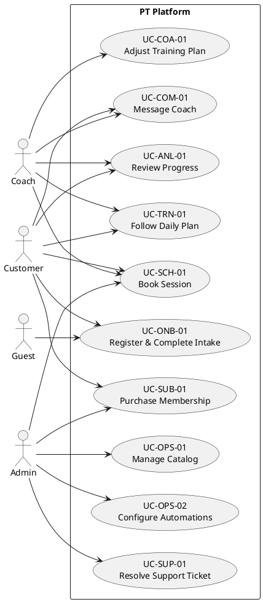

# Use Case Specification
## Customer-Centric Personal Training Platform

## UC-ONB-01 – Register & Complete Intake
- **Primary Actor:** Guest/Customer
- **Level:** User goal
- **Stakeholders & Interests:**
  - Guest: frictionless onboarding and program recommendations.
  - Business: conversion tracking and consent collection.
- **Preconditions:** Guest has access to the marketing site; regulatory consent templates are configured.
- **Postconditions:** Customer account created, intake data stored, confirmation notification sent.
- **Main Flow:**
  1. Guest selects "Get Started" CTA.
  2. System displays registration options (email/password, Google, Facebook, Apple).
  3. Guest completes registration; system verifies credentials/OTP.
  4. System launches adaptive intake questionnaire.
  5. Guest submits responses; system evaluates risk flags and suggests program tracks.
  6. System schedules optional discovery session and sends confirmations.
- **Alternative Flows:**
  - A1: Social login fails → System prompts retry or fallback to email.
  - A2: Risk flag triggered → System notifies compliance coach and displays disclaimers.
- **Exceptions:** Network/service outage → log incident and prompt guest to retry later.

## UC-SUB-01 – Purchase Membership
- **Primary Actor:** Customer
- **Scope:** Customer portal
- **Preconditions:** Customer authenticated; catalog configured.
- **Postconditions:** Subscription created, invoice generated, access entitlements updated.
- **Main Flow:**
  1. Customer browses catalog, compares plans.
  2. Customer selects plan and optional add-ons.
  3. System calculates pricing, applies promo codes.
  4. Customer accepts terms, selects payment method.
  5. Admin verifies payment (Release 1 manual) or gateway confirms (Release 2+).
  6. System activates subscription, sends receipt, updates dashboard.
- **Alternative Flow:**
  - A1: Promo code invalid → System displays error and allows re-entry.
  - A2: Payment pending manual review → System sets status "Awaiting Confirmation" and notifies admin.

## UC-TRN-01 – Follow Daily Plan
- **Primary Actor:** Customer
- **Supporting Actors:** Coach (receives updates)
- **Preconditions:** Customer has active subscription and assigned plan.
- **Postconditions:** Completion data recorded; streaks, analytics updated.
- **Main Flow:**
  1. Customer opens dashboard.
  2. System displays daily workouts, meals, and habits.
  3. Customer watches guided video, marks completion.
  4. System prompts for feedback, logs biometrics.
  5. Customer reviews achievements and badges earned.
- **Alternative Flows:**
  - A1: Customer requests exercise substitution → System suggests alternatives; notifies coach.
  - A2: Offline mode → System queues updates for sync.

## UC-SCH-01 – Book Session
- **Primary Actor:** Customer
- **Preconditions:** Availability published by coach/admin.
- **Postconditions:** Session reserved, notifications sent, calendar updated.
- **Main Flow:**
  1. Customer opens scheduling module.
  2. System displays calendar by preferred timezone.
  3. Customer selects session type (1:1, class, virtual) and time slot.
  4. System validates availability and conflicts.
  5. Customer confirms booking; system sends confirmations and reminders.
- **Alternative Flows:**
  - A1: Slot full → System offers waitlist option.
  - A2: Customer reschedules → System releases previous slot, repeats validation.

## UC-COM-01 – Message Coach
- **Primary Actor:** Customer
- **Preconditions:** Customer and coach assigned; messaging enabled.
- **Postconditions:** Message delivered, read receipt tracked.
- **Main Flow:**
  1. Customer opens chat thread.
  2. System retrieves recent messages.
  3. Customer composes message, attaches file if needed.
  4. System scans attachment, sends message in real time.
  5. Coach receives notification; read receipt updates upon view.
- **Alternative Flow:**
  - A1: Attachment fails scanning → System rejects upload, informs user.

## UC-ANL-01 – Review Progress
- **Primary Actor:** Customer (Coach/Admin as secondary viewers)
- **Preconditions:** Metrics recorded and synced.
- **Postconditions:** Insights displayed; optional reports generated.
- **Main Flow:**
  1. Customer selects analytics dashboard.
  2. System loads metrics (weight, body fat, adherence, achievements).
  3. Customer adjusts filters/time range.
  4. System updates charts instantly.
  5. Customer exports PDF/CSV if desired.

## UC-COA-01 – Adjust Training Plan
- **Primary Actor:** Coach
- **Preconditions:** Coach assigned to customer with active plan.
- **Postconditions:** Plan updated; customer notified.
- **Main Flow:**
  1. Coach opens customer profile.
  2. System displays adherence indicators and feedback.
  3. Coach edits workouts/nutrition/habits.
  4. System version-controls plan, notifies customer, logs audit.

## UC-OPS-01 – Manage Catalog
- **Primary Actor:** Admin
- **Preconditions:** Admin authenticated with proper permissions.
- **Postconditions:** Catalog updated, changes tracked.
- **Main Flow:**
  1. Admin opens catalog manager.
  2. Admin creates/updates programs, exercises, nutrition items.
  3. System validates required fields, checks duplicates.
  4. System publishes updates, propagates to storefront.

## UC-OPS-02 – Configure Automations
- **Primary Actor:** Admin
- **Preconditions:** Automation module enabled.
- **Postconditions:** Automation rule activated with logging.
- **Main Flow:**
  1. Admin opens automation builder.
  2. Admin selects trigger, conditions, and actions.
  3. System validates configuration, offers simulation.
  4. Admin activates workflow; system begins execution and logs results.

## UC-SUP-01 – Resolve Support Ticket
- **Primary Actor:** Admin/Support Agent
- **Preconditions:** Ticket created via customer portal or automation.
- **Postconditions:** Ticket resolved, customer notified, SLA tracked.
- **Main Flow:**
  1. Agent views ticket queue prioritized by SLA.
  2. Agent opens ticket, reviews context and conversation history.
  3. Agent updates status, communicates resolution, or escalates.
  4. System logs actions, updates metrics, sends closure survey.

## Traceability Overview
| Use Case | Related BRD | Related SRS Feature | Acceptance Criteria |
|----------|-------------|---------------------|---------------------|
| UC-ONB-01 | BR-01 | F1 | AC-ONB-01..04 |
| UC-SUB-01 | BR-02, BR-06 | F2 | AC-SUB-01..04 |
| UC-TRN-01 | BR-02, BR-04 | F3 | AC-TRN-01..05 |
| UC-SCH-01 | BR-03 | F4 | AC-SCH-01..05 |
| UC-COM-01 | BR-05 | F6 | AC-COM-01..03 |
| UC-ANL-01 | BR-04 | F5 | AC-ANL-01..04 |
| UC-COA-01 | BR-02, BR-07 | F7 | AC-TRN-01..05 |
| UC-OPS-01 | BR-06, BR-08 | F7 | AC-SUB-01..04, AC-ANL-02 |
| UC-OPS-02 | BR-07 | F7/F8 | AC-AUT-01..03 |
| UC-SUP-01 | BR-05, BR-08 | F6/F8 | AC-COM-07 |

