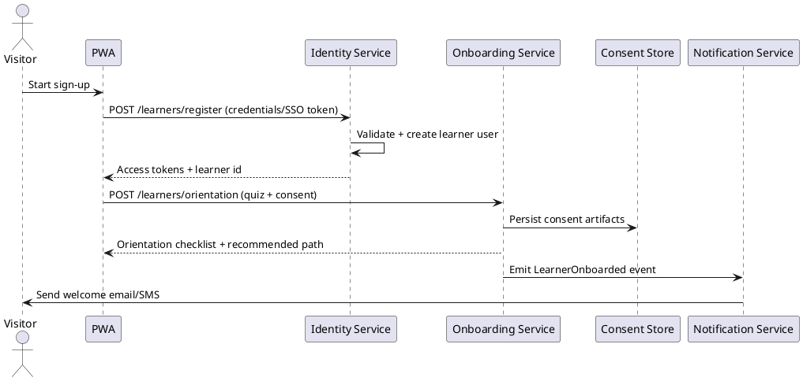
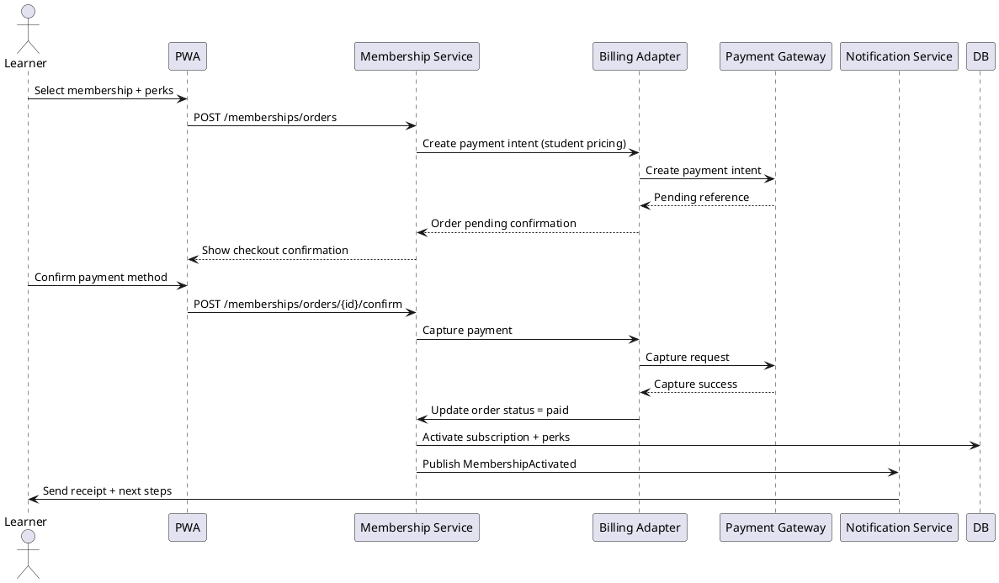
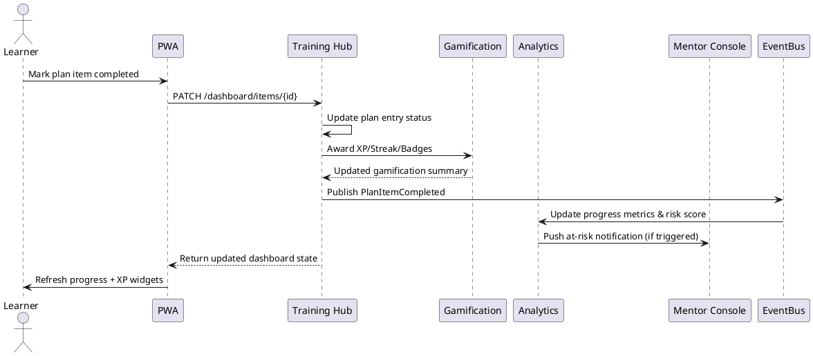
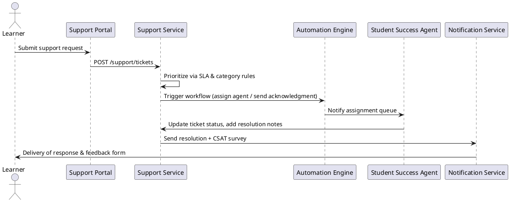

# Sequence Diagrams – FitCampus Student Portal

## 1. Learner Onboarding & Orientation


## 2. Membership Activation with Student Pricing


## 3. Daily Plan Completion & XP Award


## 4. Session Booking & Waitlist Promotion
```plantuml
@startuml
actor Learner
participant "Scheduler UI" as UI
participant "Scheduling Service" as SCHED
participant "Calendar Adapter" as CAL
participant "Notification Service" as NOTIF
actor Mentor

Learner -> UI: Browse class timetable
UI -> SCHED: GET /sessions (filters)
Learner -> UI: Book session slot
UI -> SCHED: POST /sessions/{id}/book
SCHED -> SCHED: Validate conflicts, capacity, prerequisites
SCHED -> CAL: Create calendar event via OAuth
CAL --> SCHED: Event details + join link
SCHED -> DB: Persist booking
SCHED -> NOTIF: Emit SessionBooked
NOTIF -> Learner: Confirmation + reminders
NOTIF -> Mentor: New attendee notice
...
Waitlist Scenario:
Learner -> UI: Join waitlist
UI -> SCHED: POST /sessions/{id}/waitlist
SCHED -> DB: Save waitlist position
Later: SCHED -> NOTIF: Notify waitlist promotion
Learner -> UI: One-click confirm spot
@enduml
```

## 5. Support Ticket & Escalation Workflow


