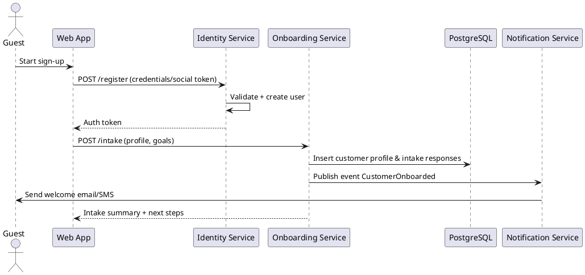
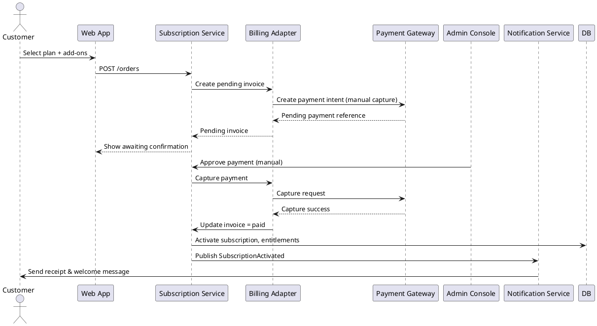
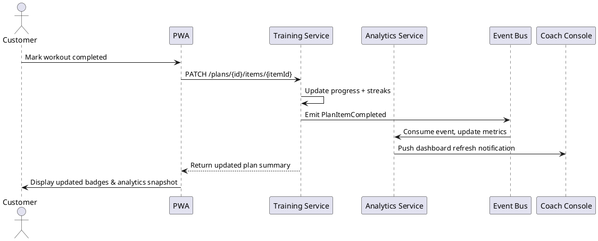
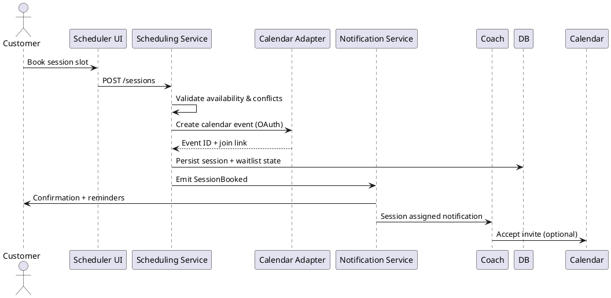
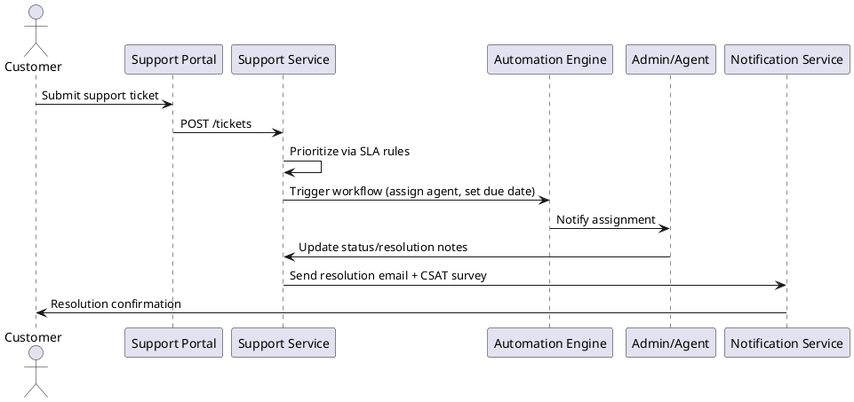

# Sequence Diagrams (Textual / PlantUML)

## 1. Customer Onboarding & Intake

## 2. Membership Purchase (Manual Confirmation Release 1)

## 3. Daily Plan Completion & Analytics Update

## 4. Session Booking & Reminder Workflow

## 5. Support Ticket Resolution Automation

